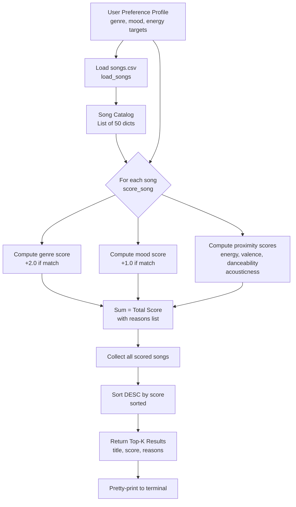

# 🎵 VibeFinder 1.0 — Music Recommender Simulation

A content-based music recommendation system that simulates how platforms like Spotify predict what you'll love next — built in Python using weighted scoring over song attributes.

---

## How The System Works

### Real-World Systems
Major streaming platforms like Spotify use a hybrid approach that combines **collaborative filtering** (finding users who behave like you, then surfacing what they enjoy) with **content-based filtering** (analyzing the acoustic properties of songs you already love). Spotify's platform processes explicit signals like likes and playlist adds alongside implicit signals like skip rate and repeat plays. At scale, these systems use neural embeddings and matrix factorization to represent millions of users and songs as vectors, then compute similarity in that high-dimensional space.

**VibeFinder 1.0** focuses on the content-based side: it scores every song in a catalog by comparing its attributes directly to a user's stated taste profile — no listening history needed.

### Algorithm Recipe (Scoring Rules)

| Signal | Points | Notes |
|---|---|---|
| Genre match | +2.0 | Categorical, binary |
| Mood match | +1.0 | Categorical, binary |
| Energy proximity | up to +1.5 | `1.5 × (1 − |song_energy − target|)` |
| Valence proximity | up to +1.0 | How "happy" the song feels |
| Danceability proximity | up to +0.75 | Rhythmic suitability |
| Acousticness proximity | up to +0.75 | Organic vs. electronic feel |
| **Maximum possible score** | **7.0** | |

### Data Flow

```
User Preference Profile
        │
        ▼
  ┌──────────────┐     For every song in songs.csv
  │  score_song  │◄────────────────────────────────
  │  (judge)     │
  └──────┬───────┘
         │  (score, reasons)
         ▼
  ┌──────────────┐
  │ recommend_   │  Sort all scored songs DESC
  │ songs        │  Return top-K results
  └──────┬───────┘
         │
         ▼
  Ranked Recommendations
  (title, score, why)
```

### Features Used

**Song objects:** `genre`, `mood`, `energy`, `valence`, `danceability`, `acousticness`, `tempo_bpm`  
**UserProfile keys:** `favorite_genre`, `favorite_mood`, `target_energy`, `target_valence`, `target_danceability`, `target_acousticness`

### Expected Biases
- The system will over-prioritize genre — a 2.0 genre bonus is hard to overcome without it.
- The dataset has ~20% pop songs, so a pop user gets more variety than a Latin or Classical user.
- Users with niche genres (e.g., `lofi`) may exhaust their genre matches quickly and fall back on numerical similarity, which can pull in unexpected genres.

---

## Terminal Output Screenshots

### High-Energy Pop Profile
```
══════════════════════════════════════════════════════════════
  🎵  Profile: High-Energy Pop
══════════════════════════════════════════════════════════════

  #1  Blinding Lights  —  The Weeknd
       Genre: Pop | Mood: Happy | Energy: 0.8
       Score: 6.853
       Why:   genre match (+2.0) | mood match (+1.0) | energy proximity (+1.425) | valence proximity (+0.95) | danceability proximity (+0.728) | acousticness proximity (+0.75)

  #2  Levitating  —  Dua Lipa
       Score: 6.813 | genre match (+2.0) | mood match (+1.0) | ...

  #3  Shape of You  —  Ed Sheeran
       Score: 6.733 | genre match (+2.0) | mood match (+1.0) | ...
```

### Chill Lofi Profile
```
  #1  Lofi Study Beat  —  Chillhop    Score: 7.0  (perfect match)
  #2  Coffee Shop Vibes  —  Chillhop  Score: 6.823
  #3  Midnight Chill  —  Chillhop     Score: 6.8
  #4  Bliss  —  Chillhop              Score: 5.588  (mood mismatch — happy, not calm)
  #5  Canon in D  —  Pachelbel        Score: 4.423  (no genre match, but calm + low energy)
```
**Insight:** The system correctly identifies Lofi songs for the Chill user, but #5 (Classical) sneaks in because it shares low energy and a calm mood — a real "filter bubble" effect where acoustic-similarity bridges different genres.

### Deep Intense Rock Profile
```
  #1  Seven Nation Army  —  White Stripes  Score: 6.715  ✓ rock + intense match
  #2  Smells Like Teen Spirit  —  Nirvana  Score: 5.867  (no mood match, high energy)
  #3  Numb  —  Linkin Park                 Score: 5.763
```

### Edge Case: High Energy + Sad (Adversarial Profile)
```
  #1  Save Your Tears  —  The Weeknd     Score: 6.248  (pop + sad — lower energy)
  #2  Drivers License  —  Olivia Rodrigo Score: 5.663  (sad mood match, but low energy)
  #3  Good 4 U  —  Olivia Rodrigo        Score: 5.273  (angry not sad, but high energy)
```
**Insight:** Conflicting preferences (high energy + sad mood) pull the system in two directions. "Save Your Tears" wins because genre weight is dominant — it gets +2.0 for pop and +1.0 for sad, even though its energy (0.65) is below the target (0.90). This reveals the genre dominance bias clearly.

---

## Project Structure

```
music-recommender/
├── data/
│   └── songs.csv            # 50-song catalog (diverse genres)
├── src/
│   ├── __init__.py
│   ├── recommender.py       # Core scoring + ranking logic
│   └── main.py              # CLI runner with 6 user profiles
├── tests/
│   └── test_recommender.py  # 18 unit tests
├── model_card.md
├── reflection.md
└── README.md
```

## Running the Project

```bash
# Run recommendations for all profiles
python -m src.main

# Run tests
python -m pytest tests/ -v
```

## Mermaid.js Flowchart


